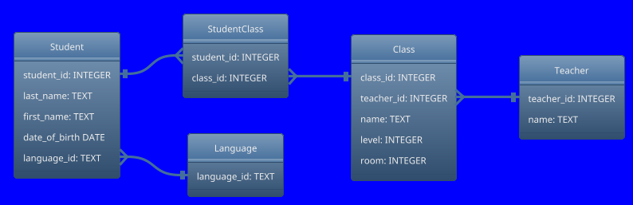

# ER Diagram

```plantuml

@startuml
!theme spacelab
skinparam backgroundcolor blue
hide circle
left to right direction

entity "Student" {
student_id: INTEGER
last_name: TEXT
first_name: TEXT
date_of_birth DATE
language_id: TEXT
}
entity "Class" {
class_id: INTEGER
teacher_id: INTEGER
name: TEXT
level: INTEGER
room: INTEGER
}
entity "StudentClass" {
student_id: INTEGER
class_id: INTEGER
}
entity "Teacher" {
teacher_id: INTEGER
name: TEXT
}
entity "Language" {
language_id: TEXT
}

Student::student_id ||--{ StudentClass::student_id
Student::language_id }--|| Language::language_id
StudentClass::class_id }--|| Class::class_id
Class::teacher_id }--|| Teacher::teacher_id


@enduml
```